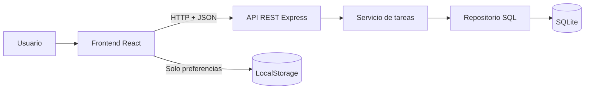
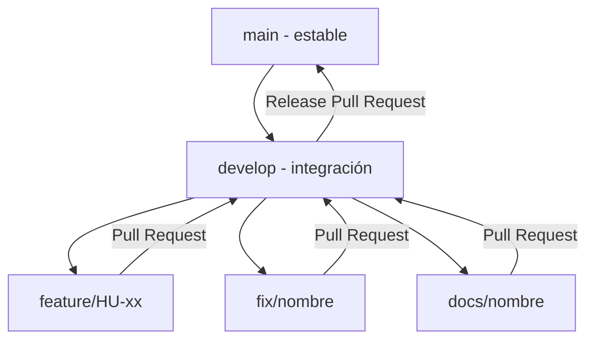

# TaskFlow

TaskFlow es una aplicación web integral para organizar y administrar tareas. La interfaz permite crear, consultar, editar, completar, eliminar, buscar y filtrar actividades; también incorpora calendario, estadísticas, preferencias, notificaciones y temas adaptativos. La información de las tareas se conserva en SQLite mediante una API REST desarrollada con Express.

## Estado del proyecto

- Versión objetivo: `v1.1.0`
- Estado: funcional y en preparación para entrega final
- Rama estable: `main`
- Rama de integración: `develop`
- Persistencia principal: SQLite
- Calidad verificada con Oxlint y compilación de produccion de Vite

## Funcionalidades

- Dashboard adaptable a computadoras y dispositivos móviles.
- Creación, consulta, edición y eliminación de tareas.
- Cambio rápido entre `Pendiente`, `En progreso` y `Completada`.
- Prioridades `Alta`, `Media` y `Baja`.
- Fecha límite y detección de tareas vencidas.
- Busqueda por título y descripción.
- Filtros por estado y prioridad.
- Calendario mensual con selección directa de mes y año.
- Agenda de actividades organizada por fecha.
- Estadisticas calculadas con datos reales.
- Preferencias persistentes de nombre, meta semanal y notificaciones.
- Tema automático según la apariencia del dispositivo, con selección manual clara u oscura.
- Colores de acento Índigo, Morado y Verde esmeralda, conservados después de recargar.
- Panel de notificaciones para tareas vencidas y próximas.
- Estados visibles de carga, error y reintento cuando la API no está disponible.
- Migracion inicial de tareas antiguas desde LocalStorage cuando SQLite está vacía.

## Arquitectura resumida

TaskFlow utiliza una arquitectura cliente-servidor con separación de responsabilidades.



La descripción completa, los diagramas y las decisiones arquitectonicas se encuentran en [docs/ARQUITECTURA.md](docs/ARQUITECTURA.md).

## Stack tecnológico

| Capa | Tecnología | Versión documentada | Uso |
|---|---|---:|---|
| Lenguaje | JavaScript con módulos ES | ES2022+ | Frontend y backend |
| Frontend | React | 19.2.7 | Componentes e interfaz reactiva |
| Herramienta frontend | Vite | 8.1.1 | Desarrollo y compilación |
| Estilos | Tailwind CSS | 4.3.3 | Diseno responsive |
| Iconos | Lucide React | 1.27.0 | Iconografia consistente |
| Backend | Express | 5.2.1 | API REST |
| Base de datos | SQLite / better-sqlite3 | 13.0.2 | Persistencia relacional local |
| Comunicación | CORS | 2.8.6 | Acceso del frontend a la API |
| Calidad | Oxlint | 1.71.0 | Analisis estático |
| Entorno | Node.js | 24.18.0 | Ejecución de JavaScript |
| Paquetes | npm | 11.6.0 | Gestión de dependencias |
| Versionado | Git y GitHub | Git 2.x | Ramas, commits, Issues y PR |

Las justificaciones están disponibles en [docs/STACK_TECNOLOGICO.md](docs/STACK_TECNOLOGICO.md).

## Requisitos previos

- Node.js 24 o una versión compatible con Vite 8.
- npm 11 o posterior.
- Git.
- Navegador web moderno.

## Instalacion

```bash
git clone https://github.com/HenrySTamina/TaskFlow.git
cd TaskFlow

# Dependencias del frontend
npm install

# Dependencias del backend
cd backend
npm install
cd ..
```

## Ejecución en desarrollo

El frontend y el backend se ejecutan en terminales distintas.

Terminal 1 - API y SQLite:

```bash
cd backend
npm run dev
```

La API queda disponible en `http://localhost:3001`.

Terminal 2 - interfaz:

```bash
npm run dev
```

La interfaz queda disponible normalmente en `http://localhost:5173`.

Abrir en el navegador:

```text
http://localhost:5173
```

## Configuración

El frontend usa por defecto:

```text
http://localhost:3001/api
```

Puede definirse otra URL mediante un archivo `.env` en la raiz:

```env
VITE_API_URL=http://localhost:3001/api
```

El backend acepta `PORT` como variable de entorno y utiliza `3001` por defecto.

## API REST

| Metodo | Endpoint | Descripción | Respuesta correcta |
|---|---|---|---:|
| `GET` | `/api/health` | Estado de API y SQLite | `200` |
| `GET` | `/api/tasks` | Consultar todas las tareas | `200` |
| `GET` | `/api/tasks/:id` | Consultar una tarea | `200` |
| `POST` | `/api/tasks` | Crear una tarea | `201` |
| `PUT` | `/api/tasks/:id` | Actualizar una tarea | `200` |
| `DELETE` | `/api/tasks/:id` | Eliminar una tarea | `204` |

Ejemplo de tarea:

```json
{
  "title": "Preparar entrega final",
  "description": "Validar TaskFlow",
  "priority": "Alta",
  "status": "Pendiente",
  "dueDate": "2026-08-03"
}
```

Validaciones principales:

- El título es obligatorio.
- La prioridad debe ser `Alta`, `Media` o `Baja`.
- El estado debe ser `Pendiente`, `En progreso` o `Completada`.
- La fecha usa el formato `YYYY-MM-DD` y debe representar una fecha real.
- Los recursos inexistentes responden `404`.
- Los datos inválidos responden `400`.

## Persistencia

La base de datos se genera automáticamente en:

```text
backend/data/taskflow.db
```

Los archivos locales de SQLite están excluidos mediante `.gitignore`. Las tareas se almacenan exclusivamente en SQLite; LocalStorage se utiliza para preferencias de interfaz —incluidos tema y color de acento— y para una migración inicial de datos antiguos.

## Estructura principal

```text
TaskFlow/
|-- backend/
|   |-- src/
|   |   |-- controllers/
|   |   |-- errors/
|   |   |-- middleware/
|   |   |-- repositories/
|   |   |-- routes/
|   |   |-- services/
|   |   |-- database.js
|   |   `-- server.js
|   `-- package.json
|-- docs/
|-- src/
|   |-- components/
|   |-- pages/
|   |-- services/
|   |-- utils/
|   `-- App.jsx
|-- package.json
`-- README.md
```

## Metodología

Se aplicó una metodología ágil incremental apoyada en un tablero de trabajo basado en GitHub Issues. Cada incremento se planeó como historia de usuario, se desarrolló en una rama independiente, se validó, se integró mediante Pull Request y se sincronizó con `develop`.

Consulta [docs/METODOLOGIA.md](docs/METODOLOGIA.md).

## Flujo de trabajo Git



Reglas principales:

1. No se trabaja directamente en `main` ni `develop`.
2. Cada Issue se implementa en una rama creada desde `develop`.
3. Los commits representan cambios pequenos y lógicos.
4. Antes de integrar se ejecutan las validaciones correspondientes.
5. La rama se publica y se abre un Pull Request hacia `develop`.
6. GitHub verifica que no existan conflictos.
7. Despues del merge se cierra el Issue y se elimina la rama.
8. Las versiones estables se integran de `develop` a `main`.

Consulta [docs/FLUJO_GIT.md](docs/FLUJO_GIT.md).

## Convencion de commits

Se utiliza una variante de Conventional Commits:

```text
tipo(alcance): descripción breve
```

Tipos usados: `feat`, `fix`, `docs`, `refactor`, `test` y `chore`.

Ejemplos reales:

```text
feat(api): exponer endpoints CRUD de tareas
feat(calendar): agregar calendario mensual y agenda
feat(settings): guardar preferencias del usuario
feat(theme): agregar controles y paletas adaptativas
fix(notifications): ajustar panel en dispositivos móviles
```

## Validación

Frontend:

```bash
npm run lint
npm run build
```

Backend:

```bash
cd backend
npm start
```

Comprobacion de salud:

```text
GET http://localhost:3001/api/health
```

La estrategia y matriz de pruebas se documentan en [docs/PRUEBAS.md](docs/PRUEBAS.md).

## Documentación

- [Metodología](docs/METODOLOGIA.md)
- [Arquitectura](docs/ARQUITECTURA.md)
- [Stack tecnológico](docs/STACK_TECNOLOGICO.md)
- [Flujo de trabajo Git](docs/FLUJO_GIT.md)
- [Pruebas y evidencias](docs/PRUEBAS.md)

## Autor

**Henry Alexander Alvaro Arcos**  
[GitHub - HenrySTamina](https://github.com/HenrySTamina)
