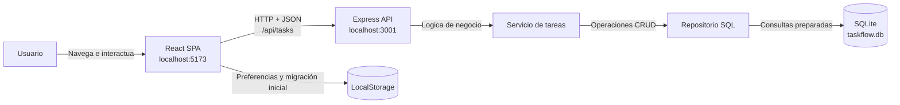
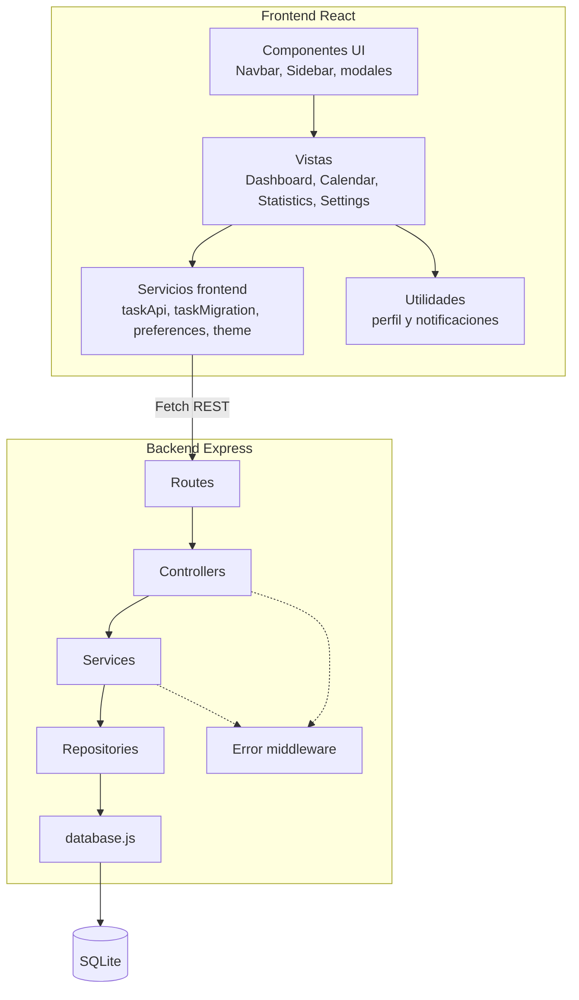
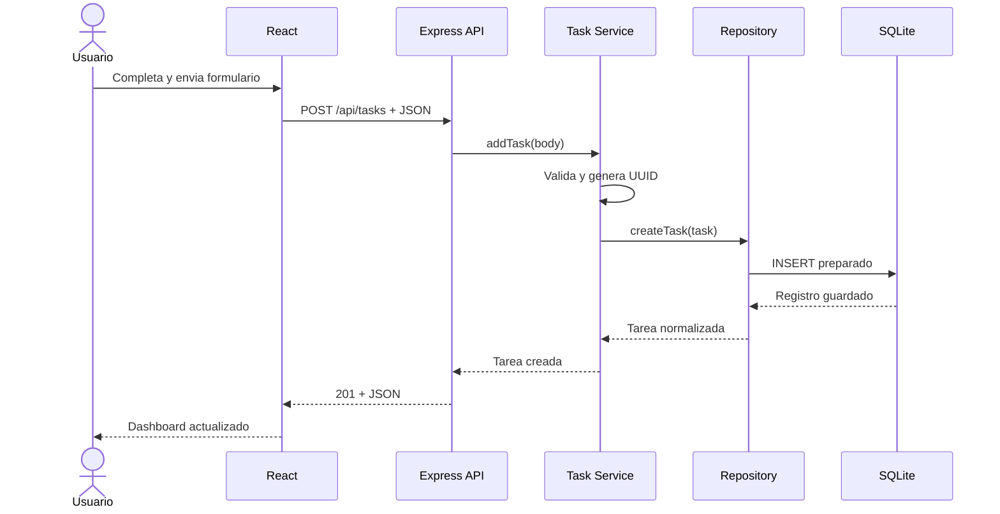
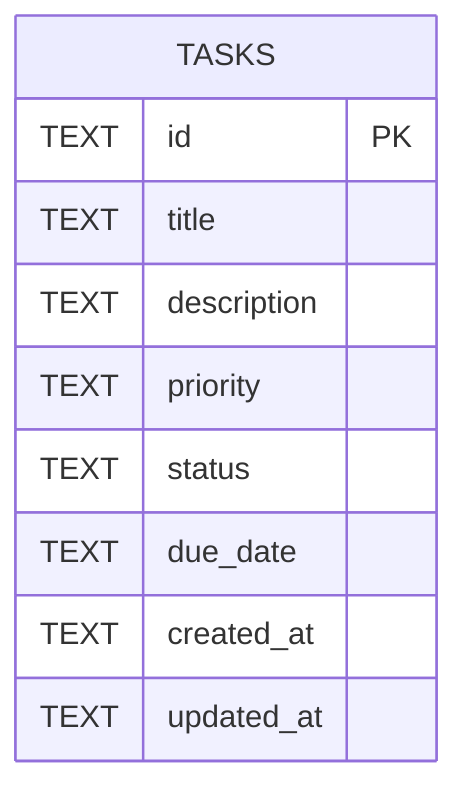
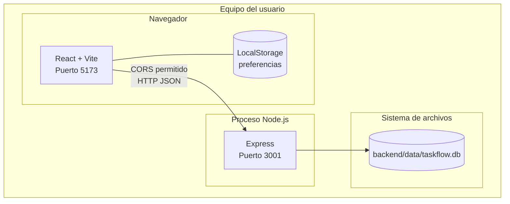

# Arquitectura del sistema

## 1. Vision general

TaskFlow utiliza una arquitectura cliente-servidor. El frontend es una aplicación de página única desarrollada con React; se comunica mediante HTTP y JSON con una API REST de Express. La API organiza sus responsabilidades en rutas, controladores, servicios y repositorios. SQLite conserva las tareas en el equipo donde se ejecuta el backend.

Las preferencias visuales se guardan en LocalStorage porque pertenecen al navegador; no sustituyen la persistencia principal de tareas. El servicio de temas detecta la apariencia del sistema, aplica atributos y variables CSS al documento y permite seleccionar manualmente modo y color de acento.

## 2. Diagrama de contenedores

## 3. Capas y componentes

## 4. Responsabilidades

| Componente | Responsabilidad |
|---|---|
| `src/App.jsx` | Mantener el estado global de la interfaz y coordinar operaciones CRUD |
| `src/pages/*` | Presentar cada vista funcional y calcular información visual |
| `src/components/layout/*` | Navegacion, encabezado y notificaciones |
| `src/components/tasks/*` | Formularios, filtros y acciones de tareas |
| `src/services/taskApi.js` | Encapsular solicitudes HTTP y normalizar errores de conexión |
| `src/services/taskMigration.js` | Migrar datos antiguos si SQLite está vacía |
| `src/services/preferences.js` | Conservar preferencias del usuario en el navegador |
| `src/services/theme.js` | Resolver el modo del sistema y aplicar tema y color de acento |
| `backend/src/routes/*` | Relacionar métodos y rutas con controladores |
| `backend/src/controllers/*` | Traducir solicitudes HTTP a llamadas de aplicación |
| `backend/src/services/*` | Validar datos y aplicar reglas de negocio |
| `backend/src/repositories/*` | Ejecutar consultas SQL preparadas |
| `backend/src/database.js` | Inicializar SQLite y crear la tabla `tasks` |
| `backend/src/middleware/error-handler.js` | Convertir errores controlados en respuestas JSON |

## 5. Comunicación entre módulos

1. El usuario realiza una acción en React.
2. `App.jsx` invoca una función de `taskApi.js`.
3. `fetch` envia una solicitud HTTP a `/api/tasks`.
4. Express dirige la solicitud mediante `task.routes.js`.
5. El controlador selecciona el caso de uso del servicio.
6. El servicio valida título, prioridad, estado y fecha.
7. El repositorio ejecuta una consulta preparada sobre SQLite.
8. El controlador responde con JSON y el código HTTP adecuado.
9. React actualiza su estado con la respuesta de la API.
10. Dashboard, calendario, estadísticas y notificaciones se recalculan automáticamente.

## 6. Secuencia de creación de una tarea

## 7. Modelo de datos

Restricciones:

- `id` es una llave primaria UUID.
- `title` es obligatorio y no admite texto vacío.
- `priority` acepta `Alta`, `Media` o `Baja`.
- `status` acepta `Pendiente`, `En progreso` o `Completada`.
- `due_date` puede ser nula.
- `created_at` y `updated_at` almacenan fechas ISO.
- SQLite usa `foreign_keys = ON` y modo de diario WAL, aunque la versión actual posee una sola entidad.

## 8. Despliegue local

La versión actual está preparada para ejecución local. Para un despliegue público se requieren un host para el frontend, un proceso persistente para Express, almacenamiento durable para SQLite y configuración CORS mediante variables de entorno.

## 9. Gestión de errores

- El frontend captura fallos de red y muestra un estado visible con boton Reintentar.
- El backend utiliza `ApiError` para errores esperados.
- Los datos inválidos producen `400 Bad Request`.
- Una tarea inexistente produce `404 Not Found`.
- Una ruta inexistente produce `404` con un mensaje claro.
- Los errores no controlados pasan por middleware centralizado.
- La eliminación correcta responde `204 No Content`.

## 10. Decisiones arquitectonicas

### React como SPA

Permite reutilizar componentes y actualizar vistas sin recargar todo el documento.

### API REST independiente

Separa presentación y datos, facilita las pruebas de endpoints y permite reemplazar el cliente en el futuro.

### Capas en el backend

Evita mezclar HTTP, validación y SQL. Cada capa puede modificarse sin reescribir las demas.

### SQLite

Ofrece persistencia relacional sin requerir un servidor adicional, apropiada para el alcance académico y ejecución local.

### Consultas preparadas

Los valores se enlazan mediante parámetros, evitando concatenar directamente entradas dentro de SQL.

### LocalStorage limitado

Se utiliza solo para preferencias, incluyendo modo de interfaz y color de acento, y para la migración inicial. La fuente principal de tareas es SQLite.

## 11. Limites conocidos

- No existe autenticación ni separación por usuarios; no se muestran controles falsos de sesión.
- CORS está configurado para `http://localhost:5173`.
- SQLite es local al proceso del backend.
- La estrategia de pruebas actual combina análisis estático, compilación y pruebas manuales; no existe aún una suite automatizada.

Estos limites se documentan para mantener consistencia entre arquitectura e implementación.
